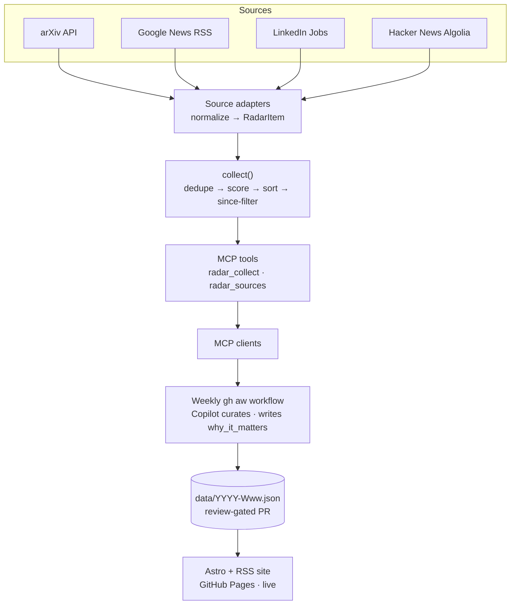

<!-- AGENT-FIRST NOTICE -->
> [!IMPORTANT]
> ### 🤖 Read this with your AI agent — don't read it by hand.
> This repo is written agent-first. Point Claude Code, GitHub Copilot, Cursor, or any agent at it:
> *"Read the README and AGENTS.md, then help me run / extend this."*
> Structure + [`AGENTS.md`](AGENTS.md) are optimized for agent comprehension.
<!-- /AGENT-FIRST NOTICE -->

<div align="center"><a name="readme-top"></a>

<a href="https://femtech-weekend.com" target="_blank">
  
</a>

# 🚀 femtech-radar

### FemTech intelligence as a GitHub-native, agent-driven pipeline

<sub>A project of <a href="https://femtech-weekend.com"><strong>FemTech Weekend</strong></a> — the live site shares the org's brand identity.</sub>

Agent-first FemTech intelligence: an MCP server that fetches, dedupes, and scores women's-health & FemTech research and industry news, designed to feed GitHub Agentic Workflows and an auto-updating Astro + RSS site.

[Live Demo][demo-link] · [Documentation][docs-link] · [Changelog](CHANGELOG.md) · [Report Bug](https://github.com/ChanMeng666/femtech-radar/issues) · [Request Feature](https://github.com/ChanMeng666/femtech-radar/issues)

<!-- SHIELD GROUP -->

[](LICENSE)
[](https://github.com/ChanMeng666/femtech-radar/actions)
[](https://github.com/ChanMeng666/femtech-radar/graphs/contributors)
[](https://github.com/ChanMeng666/femtech-radar/network/members)
[](https://github.com/ChanMeng666/femtech-radar/stargazers)
[](https://github.com/ChanMeng666/femtech-radar/issues)
[](https://github.com/sponsors/ChanMeng666)

<!-- Tech stack badges — replace with your real stack:


-->

</div>

<details>
<summary><kbd>📑 Table of Contents</kbd></summary>

- [🌟 Introduction](#-introduction)
- [✨ Key Features](#-key-features)
- [🛠️ Tech Stack](#-tech-stack)
- [🏗️ Architecture](#-architecture)
- [🚀 Getting Started](#-getting-started)
- [🛳 Project Status & Roadmap](#-project-status--roadmap)
- [📖 Usage Guide](#-usage-guide)
- [⌨️ Development](#-development)
- [🤝 Contributing](#-contributing)
- [❤️ Sponsor](#-sponsor)
- [📄 License](#-license)
- [🙋‍♀️ Author](#-author)

</details>

## 🌟 Introduction

The FemTech and women's-health world produces a scattered firehose of signal — research preprints, funding and product news, community opportunities, technical discussion — across dozens of sources. **femtech-radar** turns that noise into a curated, deduplicated, ranked digest, using only GitHub-native primitives plus a reusable [Model Context Protocol (MCP)](https://modelcontextprotocol.io) server.

It's a complete, live **three-unit pipeline** — `scrape → curate → publish`:
1. an **MCP server** (the deterministic "brain") fetches from multiple sources, normalizes into one shape, dedupes, and scores each item by **relevance × popularity × freshness**, exposing the result over MCP;
2. a weekly [GitHub Agentic Workflow (`gh aw`)](https://github.github.com/gh-aw/) drives the MCP, lets Copilot curate the digest, and commits the week's `data/*.json` via a review-gated PR;
3. an **Astro + RSS site** reads that data and auto-deploys to GitHub Pages.

It's built for **FemTech / women-in-tech practitioners** who want signal without the noise — and as a reference implementation of the `gh aw × MCP × GitHub Pages` pattern. **The product is live:** a subscribable weekly intelligence site at **https://chanmeng666.github.io/femtech-radar/** that updates itself for free on a public GitHub repo.

## ✨ Key Features

`1` **One MCP tool, a whole radar** — `radar_collect` returns normalized, deduped, scored items per section. All four sections are live: **industry** (Google News), **research** (arXiv), **opportunities** (LinkedIn, with opt-in SerpAPI Google Jobs), and **discussions** (Hacker News + Mastodon).

`2` **Deterministic, testable core** — `fetch → normalize → dedupe → score`. The server makes no editorial judgment; that's left to the agent that drives it. 28 unit tests, and **zero real network calls in tests** (all I/O is injected).

`3` **Pluggable source adapters** — each source is one file behind a uniform `Adapter` interface. Add a feed by writing a `collect()` that returns `RadarItem[]`.

`4` **Resilient by construction** — every source failure degrades to an empty result **plus a warning**; a malformed URL or date never throws out of a run.

`5` **GitHub-native, near-zero cost** — designed to run inside GitHub Actions on a **public** repo, where Actions and Pages are free; the only metered resource is a few Copilot credits per week.

`6` **Reusable anywhere MCP runs** — drop it into Claude Desktop or any MCP client; it isn't coupled to this project.

`7` **Live, self-updating, subscribable** — a weekly `gh aw` workflow curates the digest into a review-gated `data/*.json` PR, and an [Astro + RSS site](https://chanmeng666.github.io/femtech-radar/) rebuilds itself on GitHub Pages. Readers subscribe via the [full RSS feed](https://chanmeng666.github.io/femtech-radar/rss.xml) or per-section feeds at `/rss/<section>.xml` — no manual scraping, no server to run.

## 🛠️ Tech Stack

- **Language / Runtime:** TypeScript 5 (strict, ESM) · Node.js ≥ 20
- **MCP:** [`@modelcontextprotocol/sdk`](https://github.com/modelcontextprotocol) (stdio server)
- **Parsing / validation:** [Zod](https://zod.dev) (schema & runtime validation) · [fast-xml-parser](https://github.com/NaturalIntelligence/fast-xml-parser) (Atom/RSS)
- **Tooling:** pnpm workspaces (monorepo) · [Vitest](https://vitest.dev) (tests) · [tsup](https://tsup.egoist.dev) (build)
- **Orchestration:** [GitHub Agentic Workflows (`gh aw`)](https://github.github.com/gh-aw/) · engine `copilot`, model `gpt-4.1` · weekly schedule → review-gated data PR
- **Site:** [Astro 5](https://astro.build) (`femtech-radar-site`) · [`@astrojs/rss`](https://docs.astro.build/en/recipes/rss/) · GitHub Pages deploy via `deploy-pages.yml`
- **Design:** vanilla CSS design system (`site/src/styles/global.css`) aligned to the **FemTech Weekend** brand — warm-brown editorial palette, Georgia serif + system sans, sharp corners, light mode only. Full reference: [`docs/design-system.md`](docs/design-system.md)
- **Built on:** the `opportunities` adapter ports LinkedIn guest-endpoint logic from the owner's `linkedin-jobs-search` project (inspired by `linkedin-jobs-api`); the opt-in SerpAPI Google Jobs path is ported from `server-google-jobs`

## 🏗️ Architecture

<details>
<summary><kbd>System overview</kbd></summary>



All three units are built and live; all four source sections are active.

</details>

**Separation of determinism vs judgment:** the MCP server does only deterministic work (fetch, normalize, dedupe, score). Editorial choices — which items to feature, how to summarize — belong to the agent (`gh aw` + Copilot) that drives it. This keeps the core unit-testable and reusable.

## 🚀 Getting Started

### Prerequisites

- **Node.js ≥ 20** (the server uses global `fetch`)
- **pnpm ≥ 9** (`npm i -g pnpm`)
- _(optional)_ an MCP client such as Claude Desktop, or the `gh aw` CLI

### Installation

```bash
git clone https://github.com/ChanMeng666/femtech-radar.git
cd femtech-radar
pnpm install

# Build the MCP server
pnpm --filter @chanmeng666/femtech-radar-mcp build

# Run the test suite (28 tests)
pnpm --filter @chanmeng666/femtech-radar-mcp test
```

The built server is an executable stdio MCP server at `packages/mcp-server/dist/index.js`. It's also published to npm, so any MCP client can run it with `npx -y @chanmeng666/femtech-radar-mcp`.

### Run the site locally

```bash
# Dev server (reads data/*.json)
pnpm --filter femtech-radar-site dev

# Production build + preview
pnpm --filter femtech-radar-site build
pnpm --filter femtech-radar-site preview
```

The published site is live at **https://chanmeng666.github.io/femtech-radar/** (RSS: `/rss.xml`); it rebuilds automatically whenever a new weekly `data/*.json` lands on `master`.

## 🛳 Project Status & Roadmap

All three planned layers are built and live in production (see [`docs/superpowers/specs`](docs/superpowers/specs) for the full design and [`docs/superpowers/plans`](docs/superpowers/plans) for the per-unit implementation plans):

- ✅ **v1 — MCP server**: industry (Google News) + research (arXiv) adapters, dedupe/score pipeline, `radar_collect` / `radar_sources` tools, resilient error handling, 28 tests. Published to npm as `@chanmeng666/femtech-radar-mcp`.
- ✅ **v2 — orchestration**: a weekly `gh aw` workflow (engine `copilot`, model `gpt-4.1`) that drives the MCP, curates a digest, and emits a review-gated data PR plus a summary issue — proven end-to-end in production (first digest: `data/2026-W27.json`).
- ✅ **v3 — publishing** *(live)*: Astro 5 site auto-deployed to GitHub Pages at https://chanmeng666.github.io/femtech-radar/ with a subscribable RSS feed at https://chanmeng666.github.io/femtech-radar/rss.xml; rebuilds automatically on every weekly data update.
- ✅ **vNext — 4-section pipeline**: `opportunities` (LinkedIn, with opt-in SerpAPI Google Jobs) and `discussions` (Hacker News) adapters now active; per-section RSS feeds at `/rss/<section>.xml`; site polish (favicon, numeric-entity decode, sources chip); weekly workflow updated to collect all four sections.

**Deferred to a future version:** ChatOps slash commands (`/deep-dive`) and full bilingual support (i18n routing is reserved).

## 📖 Usage Guide

femtech-radar is consumed as an **MCP server**. It exposes two tools:

| Tool | Parameters | Returns |
|------|------------|---------|
| `radar_collect` | `section` (`"industry"` \| `"research"` \| `"opportunities"` \| `"discussions"`), optional `since` (ISO date, default 7 days ago), optional `limit` (default 15) | `{ items: RadarItem[], warnings: string[] }` — deduped, scored, sorted, date-filtered |
| `radar_sources` | _none_ | the configured source list per section |

> All four sections are live. `industry` (Google News) and `research` (arXiv) require no API key. `opportunities` uses LinkedIn by default (opt-in SerpAPI Google Jobs when `SERP_API_KEY` is set). `discussions` merges Hacker News Algolia + Mastodon hashtag timelines (both free, no key). LinkedIn is best-effort — graceful degradation to `[]` applies if rate-limited.

**Subscribe via RSS:** the weekly digest is published at [`https://chanmeng666.github.io/femtech-radar/rss.xml`](https://chanmeng666.github.io/femtech-radar/rss.xml) and works in any feed reader.

### Use with GitHub Agentic Workflows (`gh aw`)

```yaml
mcp-servers:
  femtech-radar:
    command: npx
    args: ["-y", "@chanmeng666/femtech-radar-mcp"]
```

### Use with Claude Desktop

```json
{
  "mcpServers": {
    "femtech-radar": {
      "command": "node",
      "args": ["/absolute/path/to/femtech-radar/packages/mcp-server/dist/index.js"]
    }
  }
}
```

> The package is published to npm, so `npx -y @chanmeng666/femtech-radar-mcp` works out of the box (current version `0.3.0`). The local `dist/index.js` path above is an alternative for development.

See [`packages/mcp-server/README.md`](packages/mcp-server/README.md) for the full tool reference.

## ⌨️ Development

```bash
pnpm install                                              # install workspace deps
pnpm --filter @chanmeng666/femtech-radar-mcp test         # run tests (Vitest)
pnpm --filter @chanmeng666/femtech-radar-mcp build        # build with tsup
```

**Project layout**

```
packages/mcp-server/src/
├── schema.ts          # Zod RadarItem / WeeklyData (the shared data contract)
├── dedup.ts           # URL canonicalization + title-similarity dedupe
├── score.ts           # relevance × popularity × freshness scoring
├── adapters/          # one file per source (industry = Google News, research = arXiv, opportunities = LinkedIn/SerpAPI, discussions = HN + Mastodon)
├── collect.ts         # orchestration: adapter → dedupe → score → sort → since-filter
├── tools.ts           # radar_collect / radar_sources handlers
└── index.ts           # stdio MCP server entry
```

**Adding a source adapter:** implement the `Adapter` interface in `adapters/`, return `RadarItem[]` from `collect(opts)` using the injected `fetcher` (never call `fetch` directly — that keeps it testable), then wire it into `ADAPTERS` in `collect.ts`.

See [`AGENTS.md`](AGENTS.md) for AI-agent-oriented project conventions and gotchas.

## 🤝 Contributing

Contributions make the open-source community an amazing place to learn and create. Please read the
[Contributing Guide](CONTRIBUTING.md) and the [Code of Conduct](CODE_OF_CONDUCT.md) before you start,
and use the provided issue / pull-request templates.

## ❤️ Sponsor

If this project helps you, please consider supporting its development:

[](https://github.com/sponsors/ChanMeng666)
[](https://buymeacoffee.com/chanmeng66u)

For questions and help, see [SUPPORT.md](SUPPORT.md). For security issues, see [SECURITY.md](SECURITY.md).

## 📄 License

This project is released under the [MIT](LICENSE) license.

## 🙋‍♀️ Author

**Chan Meng**

[](mailto:chanmeng.dev@gmail.com)
[](https://github.com/ChanMeng666)

<div align="right">

[](#readme-top)

</div>

<!-- Link definitions -->
[demo-link]: https://chanmeng666.github.io/femtech-radar/
[docs-link]: ./packages/mcp-server/README.md

---

<!-- CHAN MENG PERSONAL BRAND -->
<div align="center">
  <a href="https://github.com/ChanMeng666" target="_blank">
    
  </a>

  <p><strong>Chan Meng</strong><br/>Need a custom app like this one? I build them — let's talk.</p>

  <a href="mailto:chanmeng.dev@gmail.com"></a>
  <a href="https://github.com/ChanMeng666"></a>
</div>
<!-- /CHAN MENG PERSONAL BRAND -->
